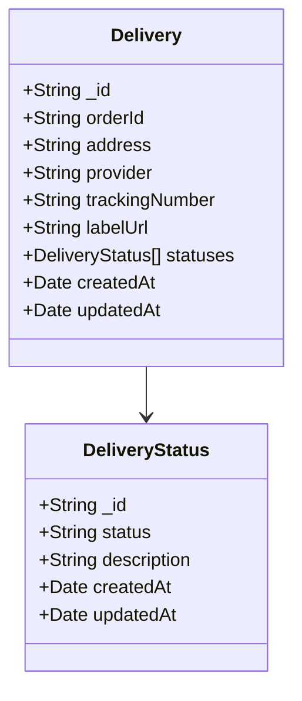

# Dogfy 🐶

## Table of Contents

- [Technologies](#technologies)
- [Architecture](#architecture)
- [Modules](#modules)
  - [Deliveries](#deliveries)
  - [Providers](#providers)
- [API Endpoints](#api-endpoints)
  - [Deliveries](#deliveries)
  - [Webhooks](#webhooks)
- [Domain Model](#domain-model)
- [Running the Application](#running-the-application)
- [Testing](#testing)
- [Simulating Provider Updates](#simulating-provider-updates)
- [Future Improvements](#future-improvements)

## Technologies

- **NestJS** - Modern, TypeScript-based backend framework
- **MongoDB/Mongoose** - NoSQL database with ODM
- **Swagger** - API documentation
- **Jest** - Testing framework
- **TypeScript** - Strongly typed programming language

### Why These Technologies?

**NestJS** was chosen because it provides a robust out-of-the-box framework with many ready-to-use features like dependency injection, module organization, error handling, cron jobs and configuration. This allowed for faster development of the microservice while maintaining good architecture principles.

**TypeScript** was selected over plain JavaScript because of its superior handling of interfaces and abstractions, which are crucial for implementing a clean hexagonal architecture.

## Architecture

This project follows a **Hexagonal Architecture** (also known as Ports and Adapters) with three distinct layers:

#### Domain

The core business logic resides here, containing entities, value objects, and domain services. This layer is completely independent of external frameworks and technologies.

#### Application

Contains use cases that orchestrate the flow of data to and from the domain layer. This layer depends on the domain layer but remains independent of infrastructure concerns.

#### Infrastructure

Implements adapters for external interactions such as HTTP controllers, database repositories, and external services. This layer depends on both the domain and application layers.

## Modules

The application is organized into two main modules:

#### Deliveries

Manages the creation, tracking, and updating of delivery information. It provides controllers for creating new deliveries and querying delivery status.

#### Providers

Handles interactions with shipping providers, including label generation and status updates. It supports two ways of receiving delivery status updates:

- **Webhook Updates**: Simulates receiving real-time callbacks from shipping providers when a delivery status changes.
- **Polling Updates**: Simulates periodic polling of shipping providers' APIs to check for status changes.

## API Endpoints

### Deliveries

| Method | Endpoint                 | Description                                  |
| ------ | ------------------------ | -------------------------------------------- |
| POST   | `/deliveries`            | Create a new delivery with shipping label    |
| GET    | `/deliveries`            | Get all deliveries                           |
| GET    | `/deliveries/:id/status` | Get the latest status of a specific delivery |

### Webhooks

| Method | Endpoint    | Description                                   |
| ------ | ----------- | --------------------------------------------- |
| POST   | `/webhooks` | Handle delivery status updates from providers |

## Domain Model



## Running the Application

### Prerequisites

- Docker
- Docker Compose

### Steps

1. Run the following command to start the application:
   ```
   docker-compose up -d
   ```
2. The API will be available at http://localhost:3000
3. Swagger documentation is available at http://localhost:3000/api

## Testing

The project includes unit tests and e2e tests. Run them using the following commands:

```bash
# Run all tests
npm test

# Run unit tests only
npm run test:unit

# Run e2e tests only
npm run test:e2e

# Run tests with coverage
npm run test:cov
```

## Simulating Provider Updates

The application supports two methods for simulating delivery status updates from providers:

### Webhook Simulation

You can simulate a provider sending a webhook update by making a POST request to the webhook endpoint:

1. Create a delivery first using the POST `/deliveries` endpoint
2. Note the `trackingNumber` from the response
3. Use Swagger UI at http://localhost:3000/api or any API client to make a POST request to `/webhooks`
4. Include a valid payload with the delivery's tracking number:

```json
{
  "provider": "TLS",
  "trackingNumber": "YOUR_TRACKING_NUMBER",
  "status": "IN_TRANSIT",
  "description": "Package is in transit"
}
```

This will update the delivery status as if the update came from the actual provider.

### Polling Simulation

The application includes a polling service that automatically simulates checking for status updates every 10 seconds:

1. Create a delivery first using the POST `/deliveries` endpoint
2. Note the `trackingNumber` from the response
3. Edit the environment configuration to target a specific tracking number:
   - Set the `TRACKING_NUMBER` environment variable to your delivery's tracking number
   - Or edit the configuration in `docker-compose.yml` by adding:
     ```yaml
     environment:
       - TRACKING_NUMBER=YOUR_TRACKING_NUMBER
     ```
4. Restart the docker container:
   ```
   docker-compose restart api
   ```

Once configured, the polling service will generate random status updates for the specified tracking number every 10 seconds. You should see logs in the docker console for each update, and the delivery status will be updated in the database.

You can verify the changes by querying the delivery status endpoint.

## Future Improvements

While this microservice provides a functional implementation of the delivery tracking system, several areas could be enhanced.

#### Authentication

The current implementation doesn't include authentication, as it wasn't essential for demonstrating the core functionality. A production version would require:

- JWT-based authentication
- Role-based access control
- API key validation for webhook endpoints

#### Cross-Cutting Concerns

Several aspects of the application currently have dependencies on the NestJS framework but should ideally be framework-agnostic:

- **Logging**: Should be implemented as a domain or application service with framework-specific adapters
- **Error Handling**: Could be improved with custom domain exceptions and more consistent error responses
- **Dependency Injection**: Currently relies on NestJS DI system, but could use a custom solution to reduce framework coupling

#### Configuration

The configuration module could be enhanced to:

- Support more environments
- Use a more robust secret management system
- Implement stricter validation

#### Input Validation

While basic validations are in place, a more comprehensive approach would include:

- More thorough input validation across all endpoints
- Domain-level invariant checks
- Custom validation decorators specific to the business domain

#### Provider Simulation

The current simulation of shipping providers could be improved by:

- Creating a dedicated microservice that simulates real shipping providers
- Implementing a small database to store provider status information
- Adding realistic delays and failure scenarios
- Supporting more complex provider interactions (cancellations, returns, etc.)

#### Monitoring and Observability

- Structured logging
- Metrics collection
- Distributed tracing
- Health check endpoints
- Performance monitoring

And there are more things I'm missing for sure 😆
